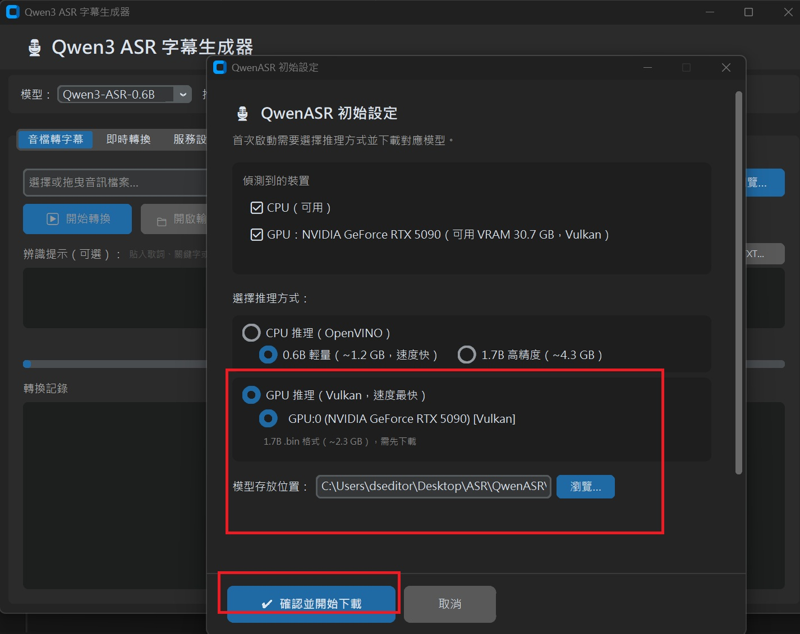
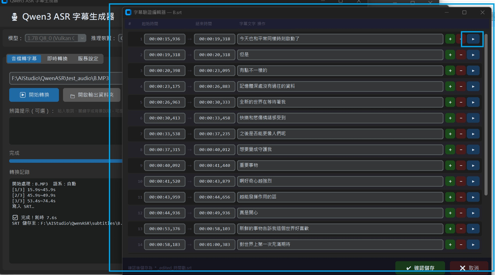

# Qwen3 ASR MiniTool

本地語音辨識字幕生成工具。基於 Qwen3-ASR-0.6B 模型，
使用 OpenVINO INT8 量化推理，**EXE 版本不使用 GPU**，純 CPU 即可執行。
此版本辨識率普通，主要是要你同事、你同學，拷貝給你阿嬤都能免費進行語音辨識。
若有 NVIDIA 或 AMD GPU，**EXE 版本**現已整合 Vulkan GPU 後端（chatllm），可於引導介面選擇 GPU 模式，載入 1.7B GGUF 模型以獲得更高辨識率。

---

## 功能

- 音訊檔案（MP3 / WAV / FLAC / M4A / OGG）→ SRT 字幕
- **影片檔案**（MP4 / MKV / AVI / MOV / WMV 等）→ 自動提取音軌 → SRT 字幕
- 即時語音辨識（麥克風輸入），並非完全串流即時，會在停頓中自動處理辨識
- 自動 VAD 靜音偵測，分段轉錄
- **說話者分離**（Speaker Diarization）：可指定說話人數，SRT 自動標記說話者身份
- **多語系辨識**：支援中文、日文、英文等 30 種語系，亦可設為自動偵測
- **辨識提示**（參考文字）：可貼入歌詞、關鍵字或背景說明，提升辨識準確度
- **大量音檔排程**：可一次匯入多個音訊 / 影片檔案，依序自動辨識並產生 SRT
- **深淺色模式**：支援深色 / 淺色介面切換，可於設定分頁自由調整
- **簡繁體中文輸出**：可於設定分頁切換輸出語系為繁體中文或簡體中文
- 首次執行請選擇資料夾自動下載模型（約 1.2 GB）
- Portable 版本包括模型開箱即用，Basic 版本檔案較小，採自動下載模型
- 若為開發者，建議使用 [uv](https://github.com/astral-project/uv) 執行環境。本專案已包含 `pyproject.toml` 與 `.python-version`，僅需執行 `uv sync` 即可完成環境配置。

---

## 使用說明

### 音檔轉字幕


1. 啟動後，上方狀態列確認顯示 **「✅ 就緒（CPU）」**，表示模型已載入完成
2. 點選「**瀏覽…**」選擇音訊檔案（MP3、WAV、FLAC、M4A 等均支援）
3. 點選「**▶ 開始轉換**」，下方進度列與記錄視窗會即時顯示各段處理狀態
4. 完成後點選「**📁 開啟輸出資料夾**」即可取得 `.srt` 字幕檔

> 首次啟動若模型尚未下載，程式會自動提示選擇存放資料夾並開始下載（約 1.2 GB），完成後自動載入。

---

### 即時語音辨識


1. 切換至「**即時轉換**」分頁
2. 在下拉選單選擇**正確的音訊輸入裝置**：
   - 筆電通常選擇預設的**麥克風陣列**（Microphone Array）
   - 桌機請選擇對應的麥克風裝置
   - 若清單顯示異常，點選「**重新整理**」更新裝置列表
3. 點選「**▶ 開始錄音**」後，對著麥克風說話
4. 辨識並非完全即時串流，**系統會在說話停頓的過程中進行辨識處理**，停頓約 0.8 秒後自動觸發，結果以時間戳記顯示在下方字幕區
5. 點選「**■ 停止錄音**」結束，可再點選「**💾 儲存 SRT**」將累積的字幕存檔

---

### 說話者分離（0221 新增）


音檔轉字幕時，可勾選「**說話者分離**」，並透過「**人數**」下拉選單指定說話人數（自動 / 2–8 人）。開啟後，SRT 字幕的每一段文字會自動加上「**說話者1：**」、「**說話者2：**」等標記。

**適用場景與限制：**
- Podcast、NotebookLM 雙人對談等**輪流說話**的形式效果最佳，分段清楚明顯
- 多人會議或**同時說話**的情境效果較不理想
- 首次使用時，程式會自動提示下載說話者分離模型（約 32 MB），下載完成即可啟用

> **建議：** 已知說話人數時請明確指定，可有效避免過度分割（例如 2 人對話被誤判為 5 人）。

---

### 多語系辨識（0221 新增）


上方工具列新增「**語系**」下拉選單，可強制指定辨識語言（預設為自動偵測）。支援中文、日文、英文、韓文、法文等共 30 種語系，對音檔轉字幕及即時辨識均有效。

- 自動偵測：模型依音訊內容判斷語言，適合多語混合的音訊
- 指定語系（如「Japanese」）：鎖定語言，可減少誤辨的情形
- 日語歌詞辨識的掉字率較中文高，但咬字清晰的音調仍能正確辨識

---

### 辨識提示 / 參考文字（0221 新增）


在「**音檔轉字幕**」和「**即時轉換**」分頁各新增一個「**辨識提示**」文字框，可貼入歌詞、關鍵字或背景說明文字，協助 ASR 模型提升辨識準確度。

- **應用範例：** 貼入 Suno 歌詞，再進行即時演唱辨識，確認歌詞是否唱正確
- 有參考文字的情況下，歌詞辨識的字詞準確度相對較高
- 亦可讀入 `.txt` 檔案，或使用右鍵選單直接貼上文字

---

### CUDA 支援（0221 更新，僅限 Source 版本，EXE 暫不支援）


現在可以支援 CUDA 以及原生 1.7B 模型，在 RTX 系列的顯示卡會有較好的辨識結果。要使用 CUDA 支援，請以 git 方式將 Source 整個 clone 下來，並點開 `start-gpu.bat` 進行環境配置。

```bash
git clone https://github.com/linuxfab/QwenASRMiniTool.git
cd QwenASRMiniTool

# 使用 uv 自動配置環境並執行
uv sync
uv run app.py  # 或執行其它腳本
```

假使你習慣傳統方式，仍可參考 `requirements.txt` 手動安裝。


啟動後會正確載入模型權重，使用 GPU 精準度會高上許多。

---

### Streamlit 前端（0222 更新，僅 GPU 服務版本）


提供標準 Streamlit 前端，現在可於 GPU 版本啟動時選擇 Streamlit 前端，方便在內網中搭建服務使用，目前預設是使用此前端，選擇 2 可以切換為原來的 Tkinter 前端。
如果只想使用 Tkinter 前端，可以直接執行 `app-gpu.py`。


Streamlit 前端可從網路端點（例如手機上）使用麥克風，採取按壓錄音方式進行錄製，傳輸到本地端辨識後再停止錄製。
若在外網需要使用，可利用 CloudFlare Tunnel 或 Ngrok 通道，但須自行注意端口保護。


---

### Qwen3-ASR-1.7B-INT8-OpenVINO 支援（Standard 版本 Basic，0222 更新）


大型更新，此模型無法包入 Portable 包中，要使用此模型，目前採自動下載方式。
當切換成 1.7B，而資料夾沒有這個模型時，就會開啟自動下載。

已經使用 Portable 的使用者，覆蓋升級至 0222 版本時，模型切換步驟為：

1. 下拉選擇「**Qwen3-ASR-1.7B INT8**」
2. 點選「**重新載入**」，即會自動開始下載並切換

> 注意：沒有點「重新載入」就不會有效果。

**效能實測**：使用 1.7B-INT8，在 8 GB RAM、i5-1135G7 2.4 GHz 筆電（2021 年 8 月出廠），辨識一小時語音約需 1300 秒（約 20 分鐘）。目前尚未開放多線程功能，約使用一半核心數的 CPU 資源。


0222 的 Basic 版本現在啟動時，若偵測不到模型，可於彈出對話框中直接勾選要下載的模型（0.6B 必選、1.7B 和說話者分離可選），確認後自動依序下載。



---

### 模型下載引導介面（0223 更新）


啟動時若尚未完成設定，程式會引導使用者選擇推理後端與下載所需模型：
- **CPU 模式**：下載 OpenVINO INT8 模型（0.6B 或 1.7B），純 CPU 執行，免安裝驅動
- **GPU 模式（Vulkan）**：下載 Qwen3-ASR-1.7B GGUF bin 檔（~2.3 GB），適用 NVIDIA / AMD / Intel 顯示卡
- 可一次勾選需要的項目，程式自動依序下載完成後載入

---

### 字幕驗證與編輯（0223 新增）



轉換完成後，點選「**🔍 字幕驗證**」按鈕開啟字幕編輯視窗：
- 每條字幕顯示起迄時間、說話者（多人模式）、文字內容
- **播放**：從該段時間點播放片段，確認辨識是否正確
- **+** / **−**：新增或刪除字幕條目
- **說話者標籤**：多人模式下可下拉調整每條字幕的說話者，並於頂部欄位設定各說話者的自訂名稱
- 完成後點「**儲存**」，產生 `{原檔名}_edited_{時間戳}.srt`

---

### Vulkan GPU 支援（0223 新增）


本版本 EXE 已整合 **chatllm Vulkan 後端**，支援主流 GPU 加速推理：
- **NVIDIA**（RTX 系列）、**AMD**（RX 系列）、**Intel** Arc 均可使用
- 無須安裝 CUDA 或 ROCm，使用 Vulkan 標準介面
- 啟動時自動偵測可用 GPU，引導介面選擇後端（CPU OpenVINO / GPU Vulkan）
- GPU 模式載入 1.7B GGUF 模型（~2.3 GB），辨識率顯著優於 0.6B CPU 版本

> 感謝 [foldl/chatllm.cpp](https://github.com/foldl/chatllm.cpp)（MIT 授權）提供 Vulkan 推理引擎。
> 本專案使用其預編譯的 `libchatllm.dll` / `ggml-vulkan.dll` / `main.exe`，
> 未從原始碼編譯。預編譯版本由 chatllm.cpp 官方於 GitHub Releases 提供。

---

### 設定分頁：深淺色模式與簡繁體輸出（0224 新增）


新增獨立「**設定**」分頁，集中管理外觀與輸出偏好：

**深淺色模式**
- 支援「**深色**」、「**淺色**」與「**跟隨系統**」三種模式
- 切換後即時生效，無需重新啟動

**簡繁體中文輸出**
- 於「**中文輸出**」選項中選擇「**繁體中文**」或「**簡體中文**」
- 使用 OpenCC 轉換，適合不同地區的使用者需求
- 對 CPU 模式（OpenVINO）與 GPU 模式（Vulkan）均有效

---

### 影片檔案直接辨識（ffmpeg 整合，0224 新增）


現在可直接選擇影片檔案（MP4、MKV、AVI、MOV、WMV 等 16 種格式），程式自動呼叫 ffmpeg 提取音軌後進行辨識，流程與音訊檔案完全一致：

1. 點選「**瀏覽…**」，直接選擇影片檔（或音訊檔）
2. 若本機尚未安裝 ffmpeg，程式會彈出對話框詢問是否**一鍵下載**（約 55 MB，Windows gpl-essentials 版）
3. 下載後儲存於 `<App 目錄>/ffmpeg/ffmpeg.exe`，後續不再提示
4. 點選「**▶ 開始轉換**」，後續與音訊辨識流程相同

**支援影片格式：** `.mp4` `.mkv` `.avi` `.mov` `.wmv` `.flv` `.webm` `.ts` `.m2ts` `.mpg` `.mpeg` `.m4v` `.vob` `.3gp` `.f4v` `.mxf`

> 若系統 PATH 已有 ffmpeg（如透過 winget / Chocolatey 安裝），程式會直接使用，不額外下載。

---

### 大量音檔排程（Batch 分頁，0224 新增）


新增「**批次辨識**」分頁，支援一次匯入大量音訊 / 影片檔案，依序自動辨識：

1. 點選「**+ 加入檔案**」可多選，亦可直接拖曳檔案進清單
2. 清單顯示每個檔案的辨識狀態（等待中 / 辨識中 / 完成 / 失敗）
3. 點選「**▶ 開始批次辨識**」後，依序處理所有檔案
4. 每個檔案完成後，點選「**⋯**」按鈕可直接開啟字幕驗證編輯器
5. 批次過程中可隨時新增檔案，不影響正在執行的任務

**適用場景：**
- 一次過處理整個會議錄音資料夾
- 批量為多集 Podcast 生成字幕
- 課堂錄影批次轉字幕

---

## 更版方式

### Python 版本

```bash
git pull
uv sync  # 更新依賴
uv run app.py
```

### EXE 編譯版本（Portable / Basic）

- **已下載過 Portable 版本的使用者**：不需重新下載 Portable，僅需下載 **Basic 版本**，解壓縮後覆蓋現有資料夾即可。
- 啟動後程式會自動檢查模型完整性；若為首次使用說話者分離功能，會彈出提示下載說話者分離模型（約 32 MB）。
- 原有的 `subtitles` 輸出資料夾內容**不會受到影響**。
- **使用 1.7B 模型**：覆蓋升級後，在模型下拉選單選擇「Qwen3-ASR-1.7B INT8」，點選「重新載入」即會自動下載（約 4.3 GB），下載完成後自動切換。

---

## 系統需求

| 項目 | CPU 模式（最低） | GPU 模式（Vulkan）|
|------|----------------|-----------------|
| 作業系統 | Windows 10 / 11（64-bit）| Windows 10 / 11（64-bit）|
| Python | 3.10 – 3.12（建議使用 `uv` 自動管理） | 3.10 – 3.12（建議使用 `uv` 自動管理）|
| RAM | 6 GB（峰值約 4.8 GB）| 8 GB（1.7B GGUF 約 2.5 GB）|
| 硬碟空間 | 2 GB（0.6B 模型 1.2 GB）| 4 GB（1.7B bin 約 2.3 GB）|
| CPU | 任意 x86-64 | 任意 x86-64 |
| GPU | 不需要 | Vulkan 1.2+ 相容（NVIDIA / AMD / Intel）|

> ⚠️ **已知問題**：若安裝路徑含有中文字元，程式可能無法正常執行。請將程式安裝於全英文路徑（例如 `C:\QwenASR`）。

---

## 模型來源

| 項目 | 連結 |
|------|------|
| 0.6B OpenVINO INT8（主要下載源） | [dseditor/Qwen3-ASR-0.6B-INT8_ASYM-OpenVINO](https://huggingface.co/dseditor/Qwen3-ASR-0.6B-INT8_ASYM-OpenVINO) |
| 0.6B OpenVINO INT8（備用下載源） | [Echo9Zulu/Qwen3-ASR-0.6B-INT8_ASYM-OpenVINO](https://huggingface.co/Echo9Zulu/Qwen3-ASR-0.6B-INT8_ASYM-OpenVINO) |
| **1.7B OpenVINO INT8 KV-Cache** | [dseditor/Qwen3-ASR-1.7B-INT8_OpenVINO](https://huggingface.co/dseditor/Qwen3-ASR-1.7B-INT8_OpenVINO) |
| **1.7B GGUF bin（GPU Vulkan 用）** | [dseditor/Collection](https://huggingface.co/dseditor/Collection)（`qwen3-asr-1.7b.bin`，~2.3 GB） |
| 原始 PyTorch 模型（0.6B） | [Qwen/Qwen3-ASR-0.6B](https://huggingface.co/Qwen/Qwen3-ASR-0.6B) |
| 原始 PyTorch 模型（1.7B） | [Qwen/Qwen3-ASR-1.7B](https://huggingface.co/Qwen/Qwen3-ASR-1.7B) |
| VAD 模型 | [snakers4/silero-vad v4.0](https://github.com/snakers4/silero-vad) |
| 說話者分離模型（分段 + 聲紋）| [altunenes/speaker-diarization-community-1-onnx](https://huggingface.co/altunenes/speaker-diarization-community-1-onnx) |

> **1.7B GGUF 模型說明**：`qwen3-asr-1.7b.bin` 為 INT4 量化版本，由 [chatllm.cpp](https://github.com/foldl/chatllm.cpp) 支援的格式，
> 作者已量化完成並上傳至 ModelScope 及 HuggingFace。直接下載即可使用，無需自行量化。

---

## 開發者說明

### 重新產生 prompt_template.json

`processor_numpy.py` 的 BPE prompt 模板需要從原始模型提取一次。
若更換模型版本，請在有 `torch + transformers` 的環境中執行 `generate_prompt_template.py`：

```bash
python generate_prompt_template.py
```

這會在目錄下產生：
- `prompt_template.json`：Prompt token ID 模板，執行程式時必須存在於根目錄
- `ov_models/mel_filters.npy`：Mel 濾波器矩陣

### 架構說明

```
app.py                  # CustomTkinter GUI 主程式（Basic / Portable EXE）
setting.py              # 設定分頁（深淺色模式、語系、模型路徑、ffmpeg 設定）
batch_tab.py            # 批次辨識分頁（大量音訊 / 影片檔案排程處理）
ffmpeg_utils.py         # ffmpeg 偵測、影片音軌提取、一鍵下載對話框
subtitle_editor.py      # 字幕驗證與編輯視窗（時間軸拖曳、播放）
chatllm_engine.py       # Vulkan GPU 推理引擎（chatllm.cpp subprocess 包裝）
app-gpu.py              # PyTorch CUDA 版本（維護模式，不再主動更新）
start-gpu.bat           # PyTorch GPU 啟動器（維護模式）
downloader.py           # 模型完整性檢查與自動下載（含 LFS 指標檔偵測）
processor_numpy.py      # 純 numpy Mel / BPE 處理器（不依賴 torch）
diarize.py              # 說話者分離引擎（兩階段聚類，不依賴 torch）
generate_prompt_template.py  # 從原始模型提取 prompt 模板
chatllm/                # Vulkan 推理 DLL 與執行檔（非 EXE 內部，需另行提供）
  libchatllm.dll             # 主要推理引擎（chatllm.cpp 預編譯）
  ggml-vulkan.dll            # Vulkan GPU 後端
  ggml-cpu-*.dll             # CPU fallback 變體
  main.exe                   # GPU 偵測與推理執行檔
ffmpeg/
  ffmpeg.exe                 # 影片音軌提取工具（首次使用影片時自動下載，~55 MB）
ov_models/
  mel_filters.npy            # 預計算 Mel 濾波器
  silero_vad_v4.onnx         # VAD 靜音偵測模型
  qwen3_asr_int8/            # 0.6B OpenVINO INT8（自動下載，~1.2 GB）
  qwen3_asr_1p7b_kv_int8/   # 1.7B OpenVINO INT8 KV-Cache（按需下載，~4.3 GB）
  diarization/               # 說話者分離 ONNX 模型（首次使用時下載，~32 MB）
    segmentation-community-1.onnx
    embedding_model.onnx
GPUModel/
  qwen3-asr-1.7b.bin         # 1.7B GGUF bin（Vulkan 用，按需下載，~2.3 GB）
```

### 第三方函式庫致謝

- **[chatllm.cpp](https://github.com/foldl/chatllm.cpp)**（foldl，MIT 授權）
  本專案使用 chatllm.cpp 的預編譯 DLL 與執行檔作為 Vulkan GPU 推理後端。
  我們使用的是官方 GitHub Releases 提供的 Windows 預編譯版本，未從原始碼自行編譯。
  感謝作者 foldl 提供高效的多後端 LLM 推理引擎，並支援 Qwen3-ASR 模型格式。

- **[FFmpeg](https://ffmpeg.org/)**（BtbN/FFmpeg-Builds，GPL 授權）
  本專案於使用者處理影片檔案時，提供 ffmpeg Windows 預編譯版本的一鍵下載引導。
  ffmpeg 二進位並未內嵌於程式本體，由使用者自行下載並同意其授權條款。

---

## 授權

本專案程式碼以 MIT 授權釋出。模型權重依各自來源的授權條款。

Vulkan GPU 後端使用 [chatllm.cpp](https://github.com/foldl/chatllm.cpp)（MIT 授權）預編譯二進位檔。
